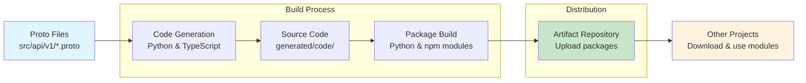

# Protobuf Code Repository

## Overview



## Repository Usage

### Where the Proto Files are Stored

The protobuf files are stored in the `src/api/` directory structure:

- **Main location**: `src/api/v1/helloworld.proto`
- **Structure**: Follows a versioned API pattern (`v1`, `v2`, etc.)
- **Current example**: Contains a `Greeter` service with gRPC methods for hello world functionality

### How to Run the Scripts (Requirements)

**Prerequisites:**

- Docker and Docker Compose installed
- Git repository (scripts use `git rev-parse --show-toplevel`)

**Available Scripts:**

- `scripts/build/generate-python.sh` - Generates Python modules
- `scripts/build/generate-typescript.sh` - Generates TypeScript/JavaScript modules

**Running the Scripts:**

```bash
# Generate Python modules
./scripts/build/generate-python.sh

# Generate TypeScript modules
./scripts/build/generate-typescript.sh

# With options
./scripts/build/generate-python.sh --clean --verbose
./scripts/build/generate-typescript.sh --grpc --clean
```

**Script Options:**

- `--clean`: Remove existing generated files
- `--verbose`: Enable detailed output
- `--python-version`: Specify Python version (default: 3.11)
- `--node-version`: Specify Node.js version (default: 20)
- `--grpc`: Enable gRPC code generation
- `--grpc-web`: Enable gRPC-Web code generation

### How the Artifacts Work

**Artifact Structure:**

- **Generated Code**: `generated/code/` - Contains language-specific generated code
- **Packages**: `generated/packages/` - Ready-to-use packages for distribution
- **Artifacts**: `artifacts/` - Final build outputs (currently has TypeScript artifacts)

**Build Process:**

1. **Container-based**: Uses Docker containers for isolated, reproducible builds
2. **Language Support**:
   - Python: Generates Python modules with proper package structure
   - TypeScript: Generates npm packages with optional gRPC support
3. **Code Quality**: Includes formatting (black/prettier) and linting tools
4. **Output**: Creates both development code and distributable packages

**Container Environment:**

- **Python Builder**: Python 3.11 with protobuf tools, black, isort
- **TypeScript Builder**: Node.js 18+ with protobuf tools, prettier, eslint
- **Docker Compose**: Orchestrates container lifecycle and build execution

The repository is designed for generating client libraries and server stubs from protobuf definitions, with a focus on Python and TypeScript/JavaScript targets, using containerized build environments for consistency and isolation.
